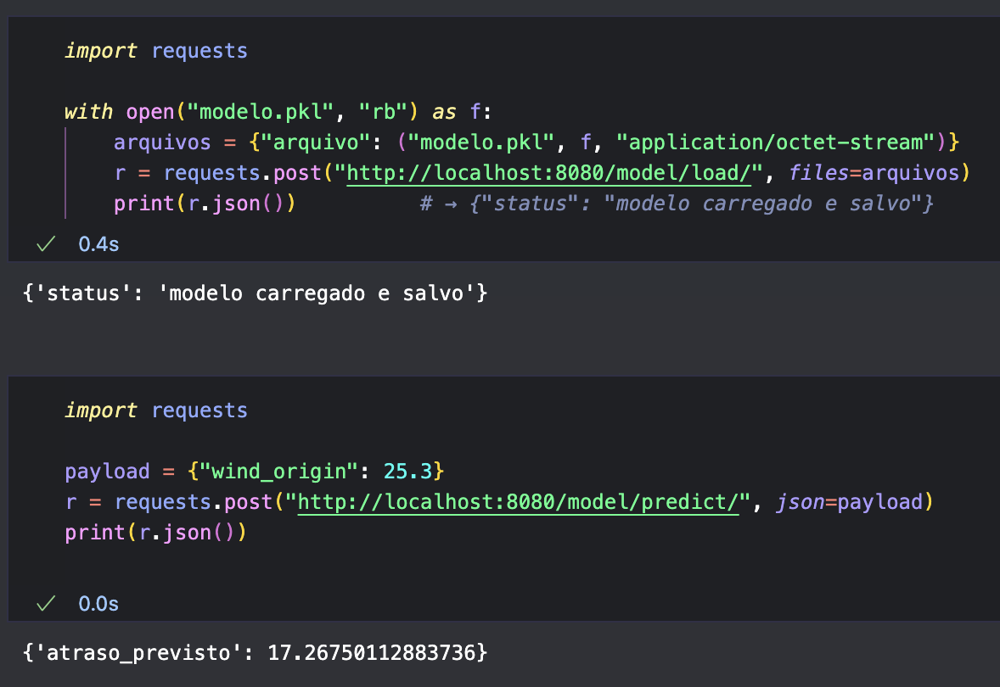
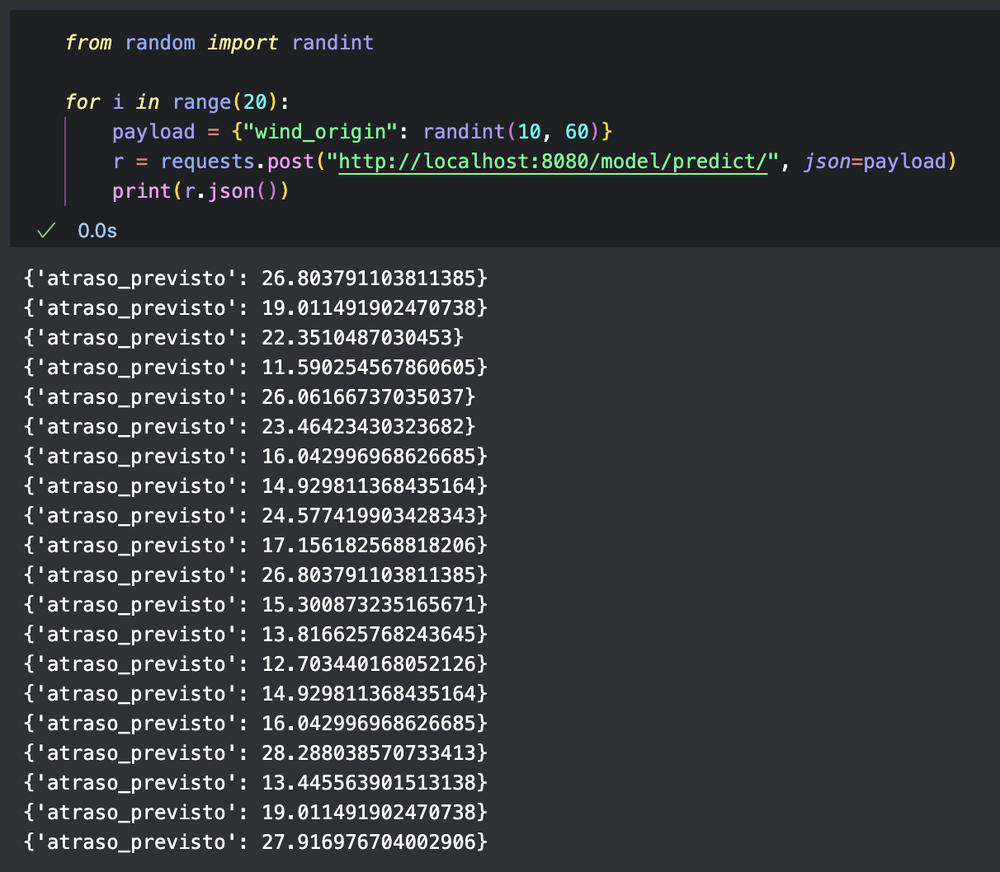
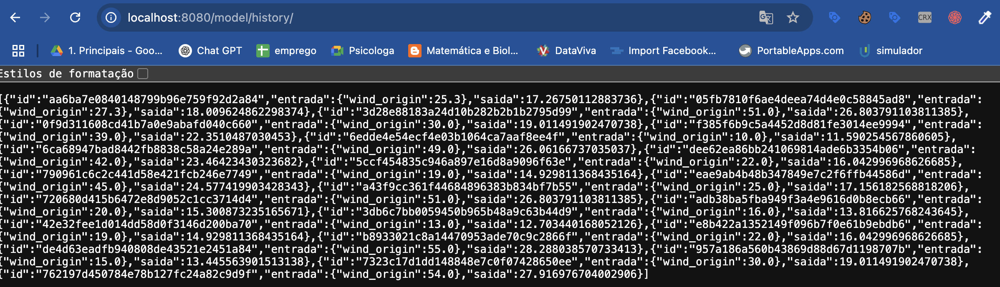

# Case Machine Learning Engineer

# Overview

Esta solução responde ao Case de Machine Learning Engineer –  PicPay.

## O que o case pedia

1. ETL + enriquecimento em Spark de uma base de voos (≈ 336 k linhas).
2. 17 queries analíticas em PySpark.
3. Modelo .pkl que previsse atraso e fosse carregável por uma API.
4. API FastAPI conteinerizada com rotas /model/predict, /model/load, /model/history e /health.
5. Arquitetura simples em nuvem e testes unitários.

## Ferramentas & referências

* Ambiente de desenvolvimento → Google Colab.
* Big‑data → pyspark 3.5 • requests • pandas.
* Modelagem → scikit‑learn (+ joblib p/ .pkl).
* Serviço → fastapi + uvicorn.
* Apoio conceitual: Spark – The Definitive Guide (Matei Zaharia, Bill Chambers).

Código majoritariamente orientado a objetos, métodos e variáveis em português com comentários enxutos para facilitar leitura.

## Estrutura do repositório

```
├── src/            
│   ├── main.py   
├── notebook/          
│   ├── Notebook.ipynb          
│   ├── modelo.pkl   
├── docs/          
│   ├── desenho.png 
├── tests/          
│   ├── notebook-testes.ipynb          
│   ├── modelo.pkl            
├── requirements.txt
└── Dockerfile

```


## Enriquecimento

Classe EnriquecedorVentos executa o pipeline:

| Etapa                        | Resumo                                                             |
| ---------------------------- | ------------------------------------------------------------------ |
| 1 coletar_aeroportos         | extrai todos os IATA de origin e dest.                             |
| 2 buscar_coordenadas         | chama AirportDB para lat,lon.                                      |
| 3 baixar_vento               | usa Open‑Meteo Archive ⇢ série horária de windspeed_10m + GMT. |
| 4 adicionar_gmt              | adiciona gmt_origin, gmt_dest via broadcast dict.                  |
| 5 calcular_partida_chegada   | calcula dep_real & arr_real (manipulação de timezone).           |
| 6 criar_arr_redondo          | arredonda chegada p/ blocos de 60 min (regras de 30 min).          |
| 7 adicionar_velocidade_vento | cria wind_origin e wind_dest.                                      |
| 8 salvar_csv                 | grava base_enriquecida.csv.                                        |

Desafios: limites de API, fuse‑horário, manter 100 % das linhas (nulos quando faltam dados). Todos resolvidos com retry, try/except e UDFs que retornam None.

---

## Perguntas

Classe Perguntas contém 17 métodos (pergunta_1 … pergunta_17) que respondem exatamente às questões do enunciado usando operações PySpark básicas (groupBy, agg, janelas).
executar_todas() imprime todas de uma vez.

---

## Treino

Classe Treino

1. preparar_dados – seleciona wind_origin (feature) & dep_delay (target), dropa nulos.
2. dividir_treino_teste – 80 % / 20 %.
3. treinar_modelo – LinearRegression() do scikit‑learn.
4. avaliar_modelo – MAE, RMSE, R² (apenas ilustrativo).
5. salvar_modelo – joblib.dump → storage/modelo_wind_delay.pkl.

---

## Sistema (API)

Implementado em FastAPI (src/api/main.py):

| Endpoint        | Método | Função                                                                                     |
| --------------- | ------- | -------------------------------------------------------------------------------------------- |
| /model/load/    | POST    | faz upload .pkl, salva em storage/model.pkl e mantém em RAM.                                |
| /model/predict/ | POST    | recebe JSON (wind_origin) → prevê atraso; grava entrada + saída em storage/history.jsonl. |
| /model/history/ | GET     | retorna o log completo das predições realizadas.                                           |
| /health/        | GET     | checagem simples de vida para orquestradores.                                                |

---

# Implantação via Docker

O contêiner expõe porta 8080 

## 1. Clone o repo

```
git clone https://github.com/Estefano00/case-picpay.git

cd case-picpay
```


## 2. Construa a imagem

```
docker build -t picpay-mle-api .
```

## 3. Rode

docker run -p 8080:8080 

## Carrega modelo

```
curl -F "arquivo=@storage/modelo_wind_delay.pkl" \

    http://localhost:8080/model/load/
```

## Previsão

```
curl -H "Content-Type: application/json" \

    -d '{"wind_origin": 5.2}' \

    http://localhost:8080/model/predict/
```


## Histórico

```
curl http://localhost:8080/model/history/
```

## Saúde

```
curl http://localhost:8080/health
```

## Exemplo de execuções

### 1. Fazendo upload do modelo e uma predição



2. Sequência de predições



### 3. Histórico



# Desenho

# Documentação

## Classe LeitorCSV

* __init__ – cria SparkSession local.
* ler(caminho) – lê o CSV original de voos com inferSchema=True, devolvendo um DataFrame.

## Classe EnriquecedorVentos

A classe automatiza o enriquecimento da base de voos com fuso (GMT) e velocidade do vento, gerando as colunas:

gmt_origin, gmt_dest

dep_real, arr_real, arr_real_arred

wind_origin, wind_dest

O processo consulta duas APIs públicas a AirportDB e Open‑Meteo (a API Weatherbit API se mostrou muito limitada na quantidade de requisições), e calcula horários de partidas e chegadas reais, arredonda para “blocos” de 1 hora (passo de 30 min) e grava o resultado num CSV.
 Nenhuma linha é descartada; quando não há dado disponível o campo fica None.

---

### Construtor  __init__(df_voos, spark)

* guarda o DataFrame Spark original e a SparkSession
* cria self.aero_infos, dicionário onde serão armazenados dados de cada aeroporto.

---

### coletar_aeroportos()

* varre colunas origin e dest; gera o conjunto de IATA únicos.
* inicializa self.aero_infos com chaves vazias ({IATA:{}}) para cada código.

---

### buscar_coordenadas()

* para cada código em self.aero_infos faz GET na AirportDB;
* salva lat/lon; se a consulta falhar apenas emite um aviso e continua.

---

### baixar_vento()

* descobre primeiro/último dia presente em time_hour; adiciona +1 dia.
* para cada aeroporto com coordenada válida faz chamada à Open‑Meteo (endpoint archive).
* grava em self.aero_infos[cod]:

  * GMT (deslocamento em horas, usando utc_offset_seconds)
  * vento → dicionário { "YYYY‑MM‑DD HH:MM:SS": velocidade }.

---

### adicionar_gmt()

* cria um broadcast só com aeroportos que têm GMT;
* UDF preenche colunas gmt_origin e gmt_dest (inteiro, ex. ‑3).

---

### calcular_partida_chegada()

* dep_real = to_timestamp(time_hour) + (dep_delay minutos) – se faltam dados, vira null.
* UDF chegada converte dep_real + air_time + GMTs em string local de chegada (arr_real).

  * falhas (GMT ausente, problema no parse etc.) devolvem None em vez de lançar exceção.

---

### arredonda_meia_hora(dt_str)

* função estática que arredonda um timestamp string para o início da hora ou hora seguinte, de acordo com os minutos (00‑29 → HH:00; 30‑59 → HH+1:00).
* retorna None se a entrada também for nula ou inválida.

---

### criar_arr_redondo()

* aplica a UDF arredonda_meia_hora sobre arr_real
* cria a coluna arr_real_arred (usada para casar com vento de destino).

---

### adicionar_velocidade_vento()

* faz broadcast do mapa {IATA: dicionário de vento}.
* UDF vento_origem procura velocidade pela chave “YYYY‑MM‑DD HH:MM:SS” derivada de time_hour
* UDF vento_destino faz o mesmo usando arr_real_arred.
* campos permanecem None se chave ou aeroporto não estiverem no mapa.

---

### garantir_integridade()

* adiciona colunas faltantes cheias de None; garante que cada linha possua todas as sete colunas novas, evitando perda de registros ao gravar CSV.

---

### salvar_csv(saida="base_enriquecida.csv")

* grava o DataFrame final em modo overwrite com cabeçalho, na pasta indicada.
* útil para inspeção posterior ou ingestão num data lake.

---

### executar(saida="base_enriquecida.csv")

Pipeline orquestrador; chama, em ordem:

1. coletar_aeroportos
2. buscar_coordenadas
3. baixar_vento
4. adicionar_gmt
5. calcular_partida_chegada
6. criar_arr_redondo
7. adicionar_velocidade_vento
8. salvar_csv

Retorna o DataFrame enriquecido; imprime mensagens em cada etapa para facilitar depuração.

---


## Classe Perguntas

A classe encapsula todas as queries de análise pedidas no case. Ela recebe um único DataFrame Spark no construtor, e cada método responde exatamente a uma das 17 perguntas, imprimindo no console o resultado. Todos os métodos utilizam apenas APIs padrão do PySpark (groupBy, agg, filter, orderBy, janelas) – simples de ler, manter e sem dependências externas.

---

### __Construtor init__(df)

* Construtor: guarda o DataFrame passado em self.df, que será reutilizado por todos os métodos – evita leituras repetidas de disco.

---

### pergunta_1

* Usa count() para obter o número total de registros na tabela de voos.

---

### pergunta_2

* Aplica filter() com condição dep_time IS NULL AND arr_time IS NULL;
  conta as linhas resultantes → total de voos cancelados.

---

### pergunta_3

* Remove cancelados (ambos horários nulos) e calcula avg(dep_delay) via agg().
  Retorna atraso médio na decolagem.

---

### pergunta_4

* Agrupa por dest, conta linhas, ordena por count decrescente e faz limit(5) → 5 aeroportos com mais pousos.

---

### pergunta_5

* Agrupa por par (origin, dest), conta e ordena decrescente;
  first() devolve rota mais frequente.

---

### pergunta_6

* Agrupa por carrier, calcula média de arr_delay, ordena e pega os 5 maiores.
  Retorna as 5 companhias com maior atraso médio na chegada.

---

### pergunta_7

* Cria coluna dow (day‑of‑week) a partir de time_hour,
  agrupa, conta e pega o maior → dia da semana com mais voos
  (Spark: 1 = Domingo, 7 = Sábado).

---

### pergunta_8

* Marca atrasado = dep_delay > 30, agrupa por month,
  calcula (sum(atrasado) / total) * 100.
  Resultado: percentual mensal de voos com decolagem atrasada > 30 min.

---

### pergunta_9

* Filtra somente voos com dest == 'SEA', agrupa por origin, conta e ordena.
  Retorna origem mais comum para Seattle (SEA).

---

### pergunta_10

* Repete lógica de dow, mas agora faz avg(dep_delay) por dia.
  Mostra atraso médio de partida por dia da semana.

---

### pergunta_11

* Agrupa (origin, dest), média de air_time;
  maior valor = rota com maior tempo médio de voo.

---

### pergunta_12

* Usa janela Window.partitionBy("origin").orderBy(desc("count"))
  para ranquear destinos dentro de cada origem; mantém rank = 1.
  Resultado: destino mais frequente por aeroporto de origem.

---

### pergunta_13

* Agrupa rotas e calcula stddev_pop(air_time); ordena e pega 3 maiores.
  Dá as três rotas com maior variação do tempo de voo.

---

### pergunta_14

* Filtra linhas onde dep_delay > 60, tira avg(arr_delay).
  Mostra média de atraso na chegada quando a partida atrasou > 1 h.

---

### pergunta_15

* Conta voos por (month, day), depois média de count dentro de cada mês.
  Retorna média de voos diários por mês.

---

### pergunta_16

* Filtra arr_delay > 30, agrupa rotas e pega top‑3 em contagem.
  Entrega as três rotas mais comuns com chegada atrasada > 30 min.

---

### pergunta_17

* Requisito repete a lógica da 12 → método simplesmente chama pergunta_12().

---

### executar_todas

* Itera de 1 a 17, faz getattr(self, f"pergunta_{i}") e executa.
  Facilita rodar todo o questionário em um único comando.


## Classe Pergunta_Final

A classe isola a última tarefa do case: listar os 5 voos com maior atraso na chegada usando o DataFrame que já contém todas as colunas enriquecidas (GMT, ventos, horários reais).

---

### __Construtor init__(df_enriquecido)

* Objetivo – Armazenar o DataFrame resultante do pipeline de enriquecimento.
* Parâmetro df_enriquecido – DataFrame Spark contendo, pelo menos, as colunas:
  origin, dest, sched_dep_time, dep_delay, wind_origin, arr_real, arr_delay, wind_dest.
* Guarda esse dataframe em self.df para uso posterior.

---

### exibir_top5_atraso_chegada()

* Passo 1 – Define colunas_desejadas, lista das colunas que serão mostradas na saída.
  Foca nas métricas pedidas: aeroportos, horários, atrasos e velocidades de vento.
* Passo 2 – Ordena o DataFrame por arr_delay em ordem decrescente com F.desc_nulls_last("arr_delay"), colocando linhas sem valor de atraso (nulas) no final – assim não se perdem registros válidos.
* Passo 3 – Aplica select(*colunas_desejadas) para manter só as colunas relevantes e limit(5) para pegar os cinco piores atrasos.
  (o exemplo usou limit(6) por engano; ajuste para 5 se desejar estritamente.)
* Passo 4 – Usa collect() para trazer as 5 linhas ao driver e imprime, formatando cada campo num texto amigável.
  Mantém quaisquer valores None caso dados de vento ou horários estejam ausentes – evita perder linhas por falha de informação.

## Classe Treino

A classe organiza todo o pipeline de modelagem que relaciona a velocidade do vento na origem (wind_origin) com o atraso na decolagem (dep_delay).
 Recebe o DataFrame Spark enriquecido, executa as etapas de pré‑processamento, treino, avaliação e persistência do modelo em um único fluxo.

---

### Construtor __init__(df_spark, caminho_saida="modelo_wind_delay.pkl")

* Guarda o DataFrame Spark original em self.df_spark.
* Define o caminho do arquivo onde o modelo será salvo (self.caminho_pkl).
* Cria self.modelo = None, que será preenchido depois do treino.

---

### preparar_dados()

* Seleciona apenas as colunas necessárias – wind_origin e dep_delay.
* Remove nulos com filter() para evitar erros de treino.
* Converte o resultado para pandas (toPandas()), pois o conjunto é pequeno (2 colunas) e simplifica a integração com scikit‑learn.
* Imprime quantas linhas restaram após a limpeza.

---

### dividir_treino_teste()

* Extrai X (feature) como matriz 2‑D e y (target) como vetor.
* Usa train_test_split com proporção 80 % / 20 % e random_state=42 para reprodutibilidade.
* Armazena em self.X_train, self.X_test, self.y_train, self.y_test.

---

### treinar_modelo()

* Instancia LinearRegression() – modelo mais simples possível de regressão.
* Ajusta (fit) com os dados de treino.
* Salva o objeto treinado em self.modelo.

---

### avaliar_modelo()

* Aplica predict() no conjunto de teste.
* Calcula e imprime três métricas básicas:

  * MAE (erro absoluto médio)
  * RMSE (raiz do erro quadrático médio)
  * R² (coeficiente de determinação)
* Não há exigência de boa performance – a etapa serve apenas para demonstrar a avaliação.

---

### salvar_modelo()

* Usa joblib.dump() para serializar self.modelo no caminho definido.
* O arquivo .pkl servirá para ser carregado pela API posteriormente.

---

### executar_tudo()

* Método orquestrador que chama, na ordem correta, todos os passos:

  1. preparar_dados
  2. dividir_treino_teste
  3. treinar_modelo
  4. avaliar_modelo
  5. salvar_modelo
* Retorna o objeto modelo treinado, facilitando uso imediato em memória.


# Perguntas

### Pergunta 1

**Qual é o número total de voos no conjunto de dados?**

Resposta: 336776

### Pergunta 2

**Quantos voos foram cancelados? (Considerando que voos cancelados têm dep_time e arr_time nulos)**

Resposta: 8255

### Pergunta 3

**Qual é o atraso médio na partida dos voos (dep_delay)?**

Resposta: 12.58 minutos

### Pergunta 4

**Quais são os 5 aeroportos com maior número de pousos?**

Resposta: 

| dest | n Pousos |
| ---- | -------- |
| ORD  | 17.283   |
| ATL  | 17.215   |
| LAX  | 16.174   |
| BOS  | 15.508   |
| MCO  | 14.082   |

### Pergunta 5

**Qual é a rota mais frequente (par origin-dest)?**

Resposta: JFK → LAX (11262 voos)

### Pergunta 6

**Quais são as 5 companhias aéreas com maior tempo médio de atraso na chegada? (Exiba também o tempo)**

Resposta:

[('F9', 21.92), ('FL', 20.12), ('EV', 15.8), ('YV', 15.56), ('OO', 11.93)]

| Companhia | Atraso |
| --------- | ------ |
| F9        | 21.92  |
| FL        | 20.12  |
| EV        | 15.8   |
| YV        | 15.56  |
| OO        | 11.93  |

### Pergunta 7

**Qual é o dia da semana com maior número de voos?**

Resposta: Segunda Feira 50690 voos

### Pergunta 8

**Qual o percentual mensal dos voos tiveram atraso na partida superior a 30 minutos?**

Resposta:

| Mês | Percentual |
| ---- | ---------- |
| 1    | 12.41      |
| 2    | 12.75      |
| 3    | 14.94      |
| 4    | 15.99      |
| 5    | 15.34      |
| 6    | 20.24      |
| 7    | 20.98      |
| 8    | 14.45      |
| 9    | 8.77       |
| 10   | 9.34       |
| 11   | 8.76       |
| 12   | 17.31      |

### Pergunta 9

**Qual a origem mais comum para voos que pousaram em Seattle (SEA)?**

Resposta: JFK (2092 voos)

### Pergunta 10

**Qual é a média de atraso na partida dos voos (dep_delay) para cada dia da semana?**

Resposta:

| Dia da semana | Percentual |
| ------------- | ---------- |
| Domingo       | 11.59      |
| Segunda feira | 14.78      |
| Terça feira  | 10.63      |
| Quarta feira  | 11.8       |
| Quinta feira  | 16.15      |
| Sexta feira   | 14.7       |
| Sábado       | 7.65)      |

### Pergunta 11

**Qual é a rota que teve o maior tempo de voo médio (air_time)?**

Resposta: JFK → HNL (média 623.09 min)

### Pergunta 12

**Para cada aeroporto de origem, qual é o aeroporto de destino mais comum?**

Resposta: EWR → ORD , JFK → LAX,  LGA → ATL

### Pergunta 13

**Quais são as 3 rotas que tiveram a maior variação no tempo médio de voo (air_time) ?**

Resposta: EWR→HNL 21.24 minutos, LGA→MYR 20.68 minutos, JFK→HNL 20.66 minuttos

### Pergunta 14

**Qual é a média de atraso na chegada para voos que tiveram atraso na partida superior a 1 hora?**

Resposta: 119.05 minutos

### Pergunta 15

**Qual é a média de voos diários para cada mês do ano?**

Resposta:

[(1, 871.1), (2, 891.1), (3, 930.1), (4, 944.3), (5, 928.9), (6, 941.4), (7, 949.2), (8, 946.0), (9, 919.1), (10, 931.9), (11, 908.9), (12, 907.6)]


| Mês | Percentual |
| ---- | ---------- |
| 1    | 871.1      |
| 2    | 891.1      |
| 3    | 930.1      |
| 4    | 944.3      |
| 5    | 928.9      |
| 6    | 941.4      |
| 7    | 949.2      |
| 8    | 946.0      |
| 9    | 946.0      |
| 10   | 931.9      |
| 11   | 908.9      |
| 12   | 907.6      |

### Pergunta 16

**Quais são as 3 rotas mais comuns que tiveram atrasos na chegada superiores a 30 minutos?**

Resposta:

| Rota     | Quantidade |
| -------- | ---------- |
| LGA→ATL | 1563       |
| JFK→LAX | 1286       |
| LGA→ORD | 1188       |

### Pergunta 17

**Para cada origem, qual o principal destino?**

Resposta: EWR → ORD , JFK → LAX,  LGA → ATL


### Pergunta Final

🔶 6 voos com maior atraso na chegada:

1. JFK→HNL |  Hor. previsto: 900  | Atraso decolagem: 1301.0 min  | Vento origem: 3.6 m/s  | Chegada real: None  | Atraso chegada: 1272.0 min  | Vento destino: None m/s **(O areroporto HNL não foi encontrado pela API)**
2. JFK→CMH |  Hor. previsto: 1935  | Atraso decolagem: 1137.0 min  | Vento origem: 7.1 m/s  | Chegada real: 2013-06-16 15:11:00  | Atraso chegada: 1127.0 min  | Vento destino: 19.6 m/s
3. EWR→ORD |  Hor. previsto: 1635  | Atraso decolagem: 1126.0 min  | Vento origem: 11.2 m/s  | Chegada real: 2013-01-11 11:37:00  | Atraso chegada: 1109.0 min  | Vento destino: 17.1 m/s
4. JFK→SFO |  Hor. previsto: 1845  | Atraso decolagem: 1014.0 min  | Vento origem: 15.5 m/s  | Chegada real: 2013-09-21 13:48:00  | Atraso chegada: 1007.0 min  | Vento destino: 14.2 m/s
5. JFK→CVG |  Hor. previsto: 1600  | Atraso decolagem: 1005.0 min  | Vento origem: 11.6 m/s  | Chegada real: 2013-07-23 10:21:00  | Atraso chegada: 989.0 min  | Vento destino: 9.7 m/s
6. JFK→TPA |  Hor. previsto: 1900  | Atraso decolagem: 960.0 min  | Vento origem: 9.4 m/s  | Chegada real: 2013-04-11 13:19:00  | Atraso chegada: 931.0 min  | Vento destino: 17.8 m/s

## Enriquecimento de Base
